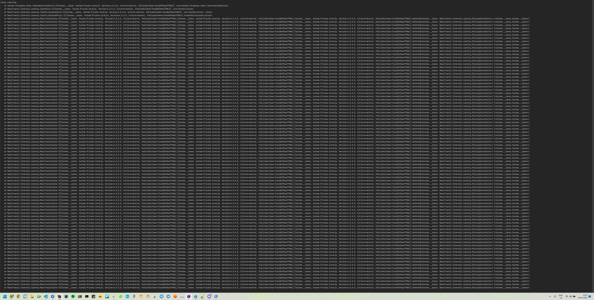
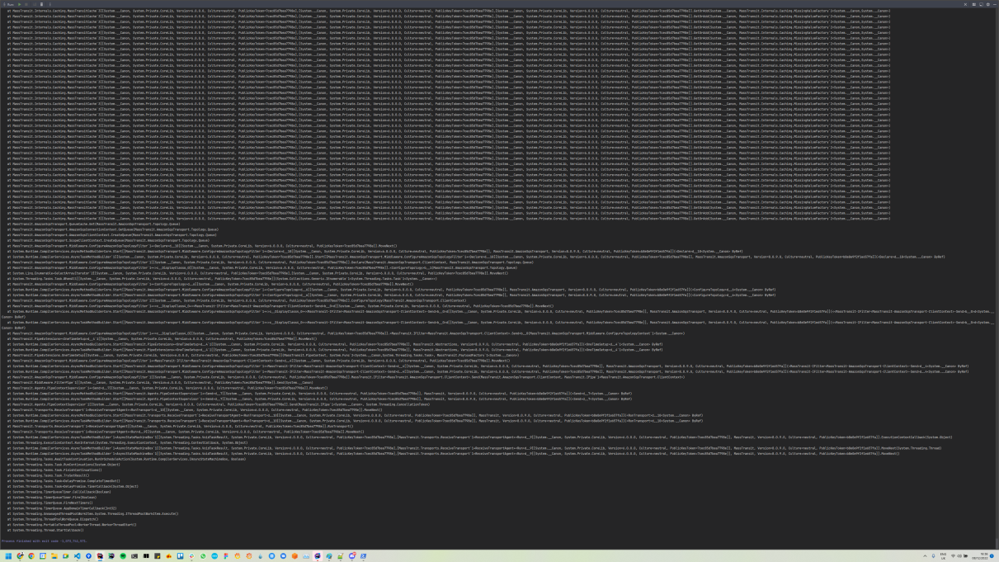

## MassTransit repo to reproduce stack overflow when creating multiple SQS queues

This bug seems to be triggered under the following conditions:

- Multiple SQS queues need to be created (the bug does not trigger with only one, and the more you add, the more likely it is to happen). If the queues already exist, the bug will not occur.
- The program should be run in regular "Run" mode in Rider rather than "Debug". The bug does not happen in "Debug" mode.
- To maximise chances of the bug occurring, make sure Dynamic Program Analysis (DPA) is switched on in Rider.

### Screenshots of the stack overflow

Apologies for the small text

